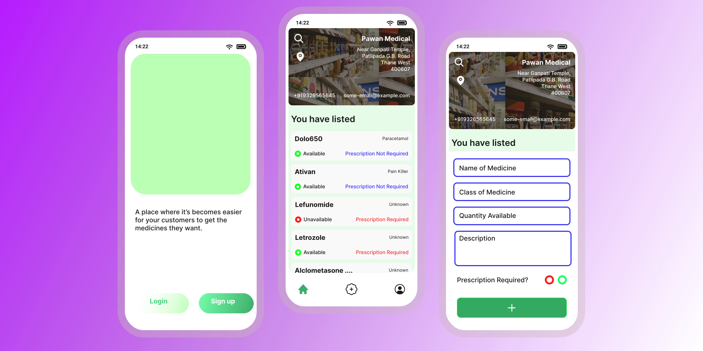

    <p align="center">
        <b>
            A service to get the medicines needed at critical moments.
        </b>
    </p>
    <p align="center">
        <a href="https://med.gulshan.cf">Website</a>
        <a href="https://med.gulshan.cf">Android: User</a>
        <a href="https://med.gulshan.cf">Android: Medical Owners</a>
    </p>
    <p align="center">
        <a href="https://twitter.com/gulshan_rox"></a>
        <a href="https://github.com/yadavgulshan/pharmaservice"></a>
        <a href="https://t.me/gyprojects"></a>
        <a href="https://github.com/yadavgulshan/pharmaservice"></a>
    </p>

<p align="center"><b>MedAlthea is a free and open-source service to get the medicines needed at critical moments.</b></p>

<p align="center"> 
<a href="https://github.com/yadavgulshan/medalthea">Project will be released for public use soon. </a>   
</p>

MedAlthea is a project built on Python, and Flutter designed to help the one in critical need of medicines.

The backend of this project is packaged as a set of Docker microservices. And the frontend is built on Flutter for faster development without compromising with performance and user experience.


We aim to make this project a success by working hard and making this project better and better everyday.

<div style="margin:10px">

</div>


**Table of Content:**
- [Installation](#installation)
- [Architecture](#architecture)
- [Contributing](#contributing)
- [License](#license)


## Installation
Since as of now only backend is available, installation won't be much of a hassle.

Ensure that you have [docker](https://www.docker.com/products/docker-desktop) installed and running.

**Starting the docker**
```
sudo systemctl start docker
```

**Building the Docker Image**
Now change the directory to backend folder and build the docker image.
```
cd backend
docker buid -t medalthea .
```

That's it for the backend. 


## Architecture
TODO

## Contributing
The project is in initial stages why not let's build it together.

If yes, then come join us in this exciting journey.

## License
This repository is available under the [BSD 3-Clause License.](LICENSE)
